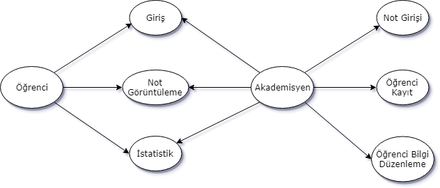

# Uludağ Üniversitesi Proje Atölyesi Programlama Etkinliği
## Bilgi
Uludağ Üniversitesi Proje Atölyesi Programlama Etkinliğinin davetlisi Murat Yücedağ tarafından yapılan uygulamalı eğitimde hazırlanmış olan projeye sadık kalınarak GitHub üzerinden erişime açılmıştır. Eksiklikler ve özellikler dileyen katılımcılar tarafından tamamlanarak sizlere sunulmaya devam edilecektir. Değerli eğitmenimiz Murat Yücedağ hocamıza ve UÜ Proje Atöylesine teşekkür ederiz. 
 [Murat Yücedağ Youtube](https://www.youtube.com/YazilimHerYerde)
 [C# Dersleri Facebook Grubumuz](https://www.facebook.com/groups/cshaprdersleri)

## Proje Kapsamında Yapılan Sunum İçeriği
Yaklaşık 5 saatlik bir sürede geliştirdiğimiz öğrenci sınav not sisteminde şu başlıkları anlatıldı;  
- Use Case Diyagram oluşturma  
- DML komutları  
- Form araçları  
- Class / Object / Property Kavramı  
- Formlar arası veri taşıma işlemleri  
- Erişim Belirleyici kavramı  
- Şartlı sorgulamalar  
- User Login Control  
- Kullanıcılar arası mesajlaşma sistemi  
- Select, Insert, Delete, Update sorgulamaları 

5 saatin sonunda Murat Hocamızın sunumu, 20 civarında öğrenci ve çalışan arkadaşın katılımıyla geliştirmeye çok müsait bir projemizi oluşturmuş olduk

## Use Case Diagram

## Tablo Yapıları
**Öğrenci Tablosu**

| Alan Adı | Alan Tipi |
| --- | --- |
| ID  | smallint  |
| Ad  | varchar(20  |
| Soyad  | varchar(30)  |
| Numara  | char(5)  |
| Sifre  | varchar(10)  |
| Sinav1  | tinyint  |
| Sinav2  | tinyint  |
| Sinav3  | tinyint  |
| Ortalama  | decimal(3, 2)  |
| Durum  | bit  |
| Fotograf  | varchar(100)  |

**Mesaj Tablosu**

| Alan Adı | Alan Tipi |
| --- | --- |
| Id | int |
| Gonderen | char(5) |
| Alici | char(5) |
| Baslik | varchar(50) |
| Icerik | varchar(250) |

**Veri tabanı oluşturma kodları**

    CREATE TABLE [dbo].[Mesajlar](
	[Id] [int] IDENTITY(1,1) NOT NULL,
	[Gonderen] [char](5) NULL,
	[Alici] [char](5) NULL,
	[Baslik] [varchar](50) NULL,
	[Icerik] [varchar](250) NULL
	)
	GO
	CREATE TABLE [dbo].[Ogrenci](
	[ID] [smallint] IDENTITY(1,1) NOT NULL,
	[Ad] [varchar](20) NULL,
	[Soyad] [varchar](30) NULL,
	[Numara] [char](5) NULL,
	[Sifre] [varchar](10) NULL,
	[Sinav1] [tinyint] NULL,
	[Sinav2] [tinyint] NULL,
	[Sinav3] [tinyint] NULL,
	[Ortalama] [decimal](5, 2) NULL,
	[Durum] [bit] NULL,
	[Fotograf] [varchar](100) NULL
	)
	GO

